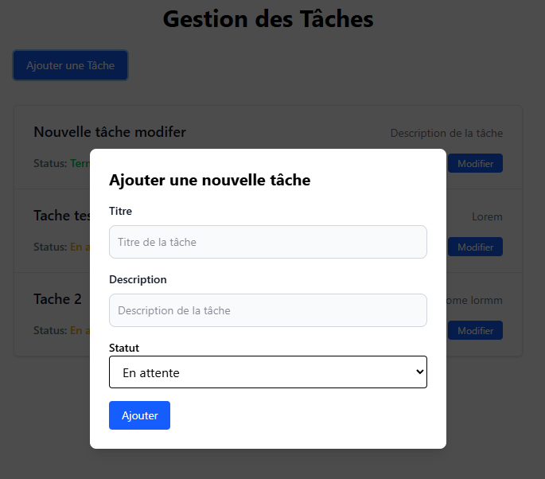
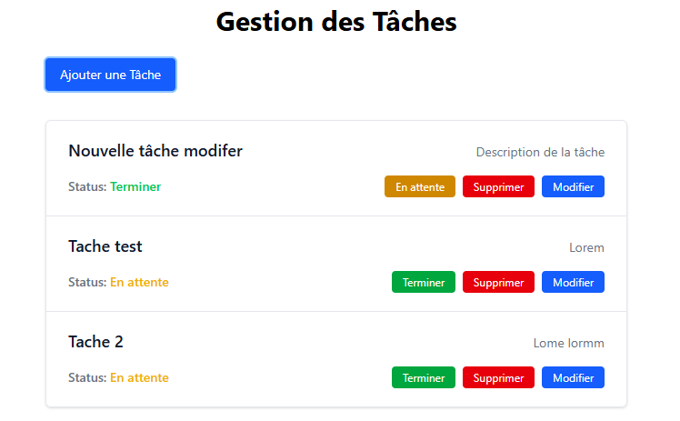

# Application de Gestion des Tâches

Ce projet est une application fullstack de gestion des tâches, développée avec **TypeScript**, **Express** pour le backend, et **React** pour le frontend. Elle permet à une de gérer une liste de tâches avec des fonctionnalités comme l'ajout, la modification, la suppression et la mise à jour du statut des tâches.

---

## Prérequis

- **Node.js** (version 18.x ou supérieure recommandée)
- **npm** (installé avec Node.js)
- **Postman** (pour tester les API)

---

## Installation

1. **Clonez le projet** :
   ```bash
   git clone <url-du-repo>
   cd todo-app
   ```

2. **Installez les dépendances pour le backend** :
   ```bash
   cd backend
   npm install
   ```

3. **Installez les dépendances pour le frontend** :
   ```bash
   cd ../frontend
   npm install
   ```

---

## Lancer le projet

### 1. **Démarrer le backend**
   Accédez au dossier `backend` et lancez le serveur :
   ```bash
   cd backend
   npm run dev
   ```

   Le backend sera accessible à l'adresse [http://localhost:3000](http://localhost:3000).

### 2. **Démarrer le frontend**
   Accédez au dossier `frontend` et lancez le serveur de développement :
   ```bash
   cd ../frontend
   npm run dev
   ```

   Le frontend sera accessible à l'adresse [http://localhost:5173](http://localhost:5173).

---

## Tester les API avec Postman

Une collection Postman est disponible pour tester les endpoints de l'API. Voici comment l'utiliser :

1. **Ouvrez Postman**.
2. **Importez la collection** :
   - Cliquez sur le bouton **Importer** dans Postman.
   - Sélectionnez le fichier `Topo App API.postman_collection.json` situé à la racine du projet.
3. **Configurez la variable `baseUrlLiv`** :
   - Dans Postman, allez dans **Environnement** et créez une variable `baseUrlLiv`.
   - Définissez sa valeur sur `http://localhost:3000/`.
4. **Testez les endpoints** :
   - Utilisez les requêtes disponibles dans la collection pour tester les fonctionnalités suivantes :
     - **GET /tasks** : Récupère toutes les tâches.
     - **POST /tasks** : Crée une nouvelle tâche.
     - **PATCH /tasks/:id** : Met à jour le statut d'une tâche.
     - **DELETE /tasks/:id** : Supprime une tâche par son ID.

---

## Fonctionnalités

### Backend
- **API REST** :
  - `GET /tasks` : Récupère toutes les tâches.
  - `POST /tasks` : Crée une nouvelle tâche.
  - `PATCH /tasks/:id` : Met à jour une tâche (titre, description, statut).
  - `DELETE /tasks/:id` : Supprime une tâche par son ID.
- **Validation des données** avec **Zod**.
- **Gestion des erreurs** avec des messages clairs.

### Frontend
- **Affichage des tâches** sous forme de cartes.
- **Ajout d'une tâche** via un formulaire dans un modal.
- **Modification d'une tâche** avec un formulaire pré-rempli.
- **Suppression d'une tâche** avec un bouton dédié.
- **Mise à jour du statut** (en attente/terminée) via un bouton.

---

## Aperçu du Frontend

### Liste des tâches


### Modal pour ajouter une tâche


---

## Technologies utilisées

### Backend
- **Express** : Framework minimaliste pour construire l'API REST.
- **TypeScript** : Typage statique pour un code robuste.
- **Zod** : Validation des données côté serveur.
- **UUID** : Génération d'identifiants uniques pour les tâches.

### Frontend
- **React** : Bibliothèque JavaScript pour construire l'interface utilisateur.
- **TypeScript** : Typage statique pour un code robuste.
- **Vite** : Outil de build rapide pour les projets frontend.
- **React Query** : Gestion des requêtes API et du cache.
- **Tailwind CSS** : Framework CSS utilitaire pour un design moderne.
- **Axios** : Client HTTP pour les appels API.
- **Zod** : Validation des données côté client.
- **React Hook Form** : Gestion des formulaires.

---

## Structure du projet

```
todo-app/
├── backend/        # Code source du backend
│   ├── src/
│   │   ├── controllers/  # Logique des routes
│   │   ├── routes/       # Définition des routes
│   │   ├── services/     # Gestion des données
│   │   ├── types/        # Types TypeScript
│   │   └── index.ts      # Point d'entrée du serveur
│   ├── data/             # Fichier JSON pour stocker les tâches
│   └── package.json      # Dépendances backend
├── frontend/       # Code source du frontend
│   ├── src/
│   │   ├── api/          # Appels API vers le backend
│   │   ├── components/   # Composants réutilisables
│   │   ├── hooks/        # Hooks
│   │   ├── types/        # Types TypeScript
│   │   ├── App.tsx       # Composant principal
│   │   └── main.tsx      # Point d'entrée du frontend
│   └── package.json      # Dépendances frontend
├── screenshot/     # Captures d'écran du frontend
│   ├── tasks.png
│   ├── add_task_modal.png
├── Topo App API.postman_collection.json  # Collection Postman pour tester l'API
└── README.md       # Documentation globale
```

---

## Notes

- **Backend** : Assurez-vous que le backend est en cours d'exécution avant de lancer le frontend.
- **Frontend** : Vérifiez que le backend est accessible à l'adresse [http://localhost:3000](http://localhost:3000).
- Si vous rencontrez des problèmes, vérifiez les logs du terminal pour le backend et les logs du navigateur pour le frontend.

---

## Licence

Ce projet est sous licence MIT.